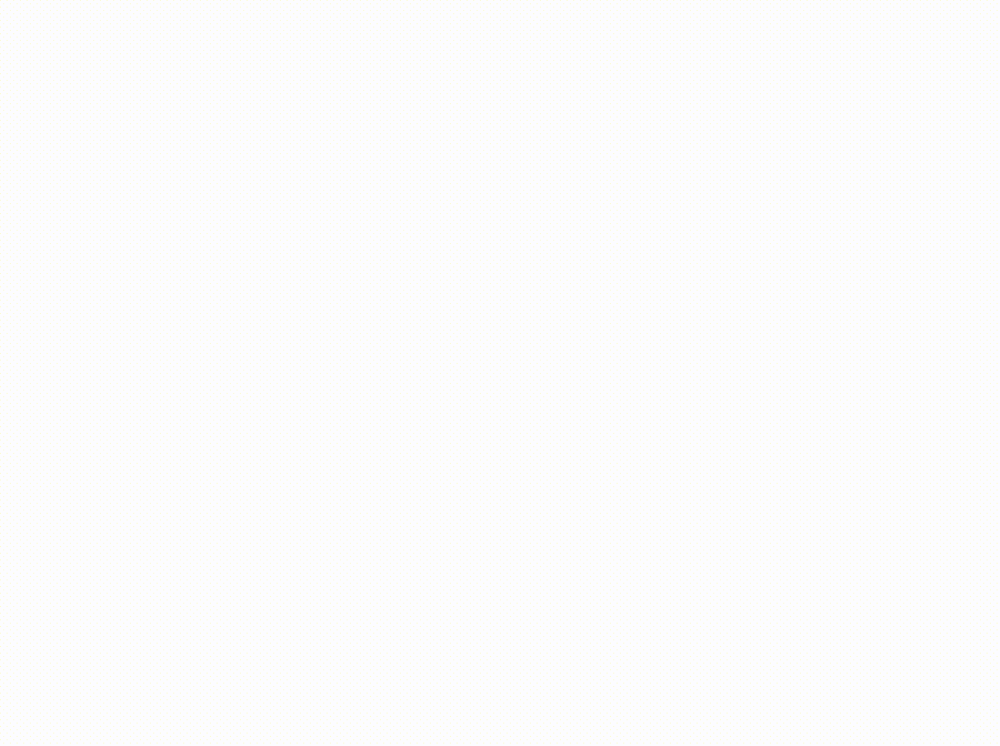
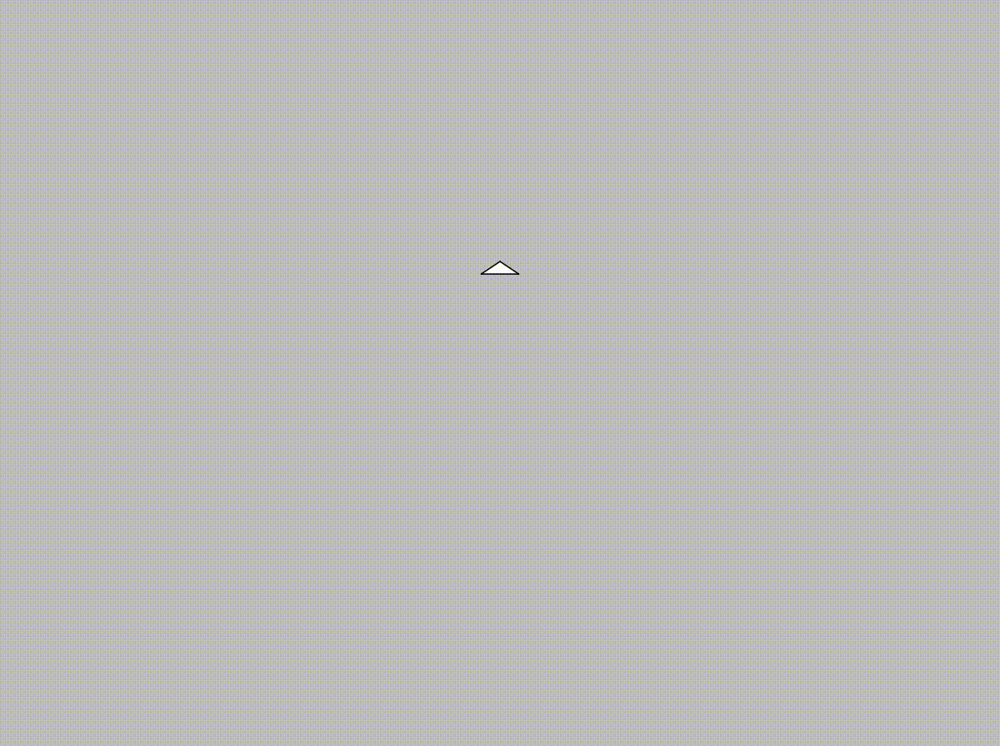

# Examples

The examples in this directory are meant to help teach you about different
aspects of the turtle crate. Each example shows a different way of using it
to create a drawing. 

Examples range from "beginner" to "advanced". This rating is subjective and
subject to change, so you may find that you're able to understand examples
in one of the higher categories even if you're still learning. The examples
listed here are just a few of the more prominent ones from the crate. See
the other files in the `examples` directory for even more.

## Table of Contents

<!-- TODO: Make a more detailed table of contents that lists all the examples -->

* [Beginner](#level-beginner)
* [Intermediate](#level-intermediate)
* [Advanced](#level-advanced)

## Level: Beginner

### Simple Square

**Source Code**: [square.rs](square.rs)

This is almost the simplest turtle program possible: it draws a non-centered
square on the canvas by repeating the two basic `forward` and `right` methods.

### Simple Circle

**Source Code**: [circle.rs](circle.rs)

This circle is drawn using many small lines and short turns. It's hard to tell
just by looking at it, but it isn't actually perfectly round!

### Dashed Circle

**Source Code**: [dashed_circle.rs](dashed_circle.rs)

This image is drawn using the `pen_up` and `pen_down` methods to periodically
lift the pen as the turtle moves around the circle. The code uses integer
division as well as the remainder operator to figure out when to lift and
lower the pen.

### Radioactive Triangles

**Source Code**: [three-triangles.rs](three-triangles.rs)

Draws three equilateral triangles and shows how the program for a single triangle
can be reused to draw several of them.

### Five-pointed Star

**Source Code**: [empty_star.rs](empty_star.rs)

A five-pointed star with no lines in the middle. The background color is changed
from the default white and the pen size and pen color are changed as well. This
is done using the `set_background_color`, `set_pen_size`, and `set_pen_color`
methods respectively.

## Level: Intermediate

### Square-petalled Flower

**Source Code**: [squares.rs](squares.rs)

This program repeatedly draws squares while rotating the turtle to produce a
square-petalled flower. The red and white squares are colored using the
`set_fill_color`, `begin_fill` and `end_fill` methods.

### Isometric Nested Cubes

**Source Code**: [nestedcubes.rs](nestedcubes.rs)

This example draws a hexagonal spiral with a fading color that alternates
between blue and white. It creates an illusion of nested three-dimensional
cubes isometrically projected onto the two-dimensional space of the canvas.

### Randomly-colored Tornado

**Source Code**: [coloredridge.rs](coloredridge.rs)

This example varies the pen size and color as the turtle moves. The size is
set to the value of a gaussian function and random pen colors are used to
ensure that you'll get a completely different image every time.

### Heart

**Source Code**: [heart.rs](heart.rs)

A cute drawing of a heart. The arcs are more difficult to draw than you
might expect!

### Rust Logo

**Source Code**: [rust.rs](rust.rs)

A (simplified) version of the [logo][rust-logo] for the Rust
programming language.

[rust-logo]: https://github.com/rust-lang/rust-artwork/blob/master/logo/rust-logo-blk.svg

### Snowman

**Source Code**: [snowman.rs](snowman.rs)

A nice-looking snowman with all its common features.

### Turtle

**Source Code**: [draw_turtle.rs](draw_turtle.rs)

A turtle drawn by... a turtle!

## Level: Advanced

### Heighway Dragon Curve

**Source Code**: [dragon.rs](dragon.rs)

Draws a [Heighway dragon curve](https://en.wikipedia.org/wiki/Dragon_curve).
This self-similar fractal curve is generated by recursively unfolding a line by
90°. Step 1 is to draw a line segment. Step 2 is to duplicate the line segment
from Step 1 and rotate it by 90° along one of its extremities to create a new
extremity. You repeat the process using the new extremity and continue along to
generate each line.

### Square Fractal Tree

**Source Code**: [tree.rs](tree.rs)

This is a tree-like fractal curve where the trunks or branches are squares
rather than lines. The sizes are chosen to make two squares' vertices coincide.

### Von Koch Snowflake

**Source Code**: [snowflake.rs](snowflake.rs)

Draws a [Von Koch snowflake](https://en.wikipedia.org/wiki/Koch_snowflake).
This uses yet another recursive algorithm: Step 1 is an equilateral triangle.
Step 2 is cutting each of its sides in three and replacing their middle parts
with an equilateral triangle with sides of the same length as the surrounding
parts but without a base side. Step n + 1 is repeating the process for each
side of step n. Note there is no "cutting" happening during the drawing, all
the drawn sides are the same length, but the turning angles are computed
recursively following the described algorithm.

### Random Maze Generator + Solver

**Source Code**: [maze/main.rs](maze/main.rs)

In this example, the turtle generates and draws a maze. Then, it goes through
and solves the maze by moving through the passages until it finds the exit.
